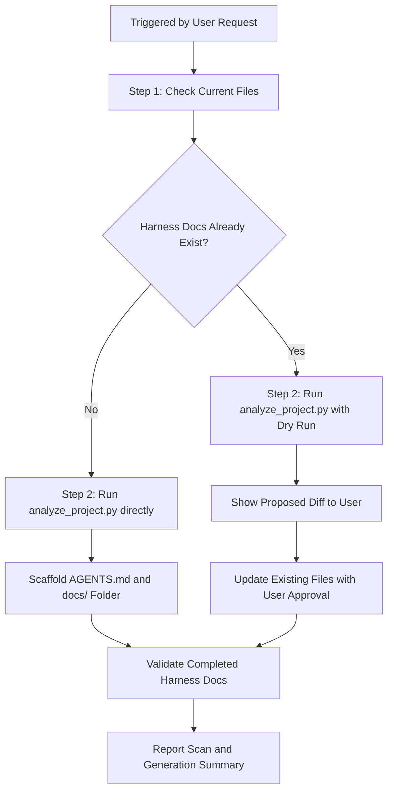

# Project Review & Codebase Scaffolding Skill

## Overview

This skill enables AI coding agents to perform comprehensive repository scanning, auto-detect active programming languages, web frameworks, configuration files, and components, and build or update standard Harness v0 collaboration documents.

## When to Use This Skill

- Use when the user requests "project review", "scan project", "analyze codebase", "generate architecture.md", "build harness docs", or "setup project harness".
- Use on onboarding to a new codebase to discover its layout, tools, and technical dependencies.
- Use to audit an existing Harness and enrich it with newly added folders or dependencies.
- Do **NOT** use if the repository already has an active, custom, established project operating harness that differs from `harness-experimental`.

## Core Capabilities

1. **Static Analysis & Language Detection**: Scans workspace directories (ignoring `node_modules`, `.git`, etc.) to calculate file ratios and identify active technical stacks.
2. **Framework Identification**: Parses package definitions (`package.json`, `requirements.txt`, `Cargo.toml`, etc.) to find web frameworks (e.g., React, NestJS, Express, FastAPI, Actix, Rails).
3. **Premium Harness Generation**: Generates or updates standard-compliant, premium Harness v0 markdown documents tailored to the discovered tech stack.

---

## Workflow Decision Tree

To run this skill successfully, follow this step-by-step workflow:



### Step 1: Check Current Files

Scan the target repository to see if `AGENTS.md` or `docs/` folders already exist:
- If they do not exist: We will do a fresh setup.
- If they do exist: We should run with `--dry-run` to preview the generated files before making changes, or ask the user to confirm merging/overwriting.

### Step 2: Run the Project Analyzer

Execute the bundled Python analyzer script. This script automatically crawls the directory structure and builds the profile:

```powershell
# Run dry-run to preview what will be generated
python .agents/skills/project-review/scripts/analyze_project.py --dry-run

# Run full scaffolding and automatically confirm writing files
python .agents/skills/project-review/scripts/analyze_project.py --yes
```

### Step 3: Validate and Review

After running the script, verify that:
1. `AGENTS.md` is present in the workspace root.
2. `docs/HARNESS.md`, `docs/ARCHITECTURE.md`, `docs/FEATURE_INTAKE.md`, and `docs/TEST_MATRIX.md` are present.
3. The directory trees and technology stack in `docs/ARCHITECTURE.md` are completely filled and contain no placeholders.

---

## Best Practices and Rules

- **UTF-8 Encoding**: Always read and write harness documents using UTF-8 encoding.
- **Maintain Custom Work**: If the user has custom entries in `docs/TEST_MATRIX.md` or `docs/stories/`, ensure you do not overwrite their modifications. Run in dry-run mode or check manually before performing overwrites.
- **Accurate Profile**: Verify that folder listings in `docs/ARCHITECTURE.md` match the actual components.
